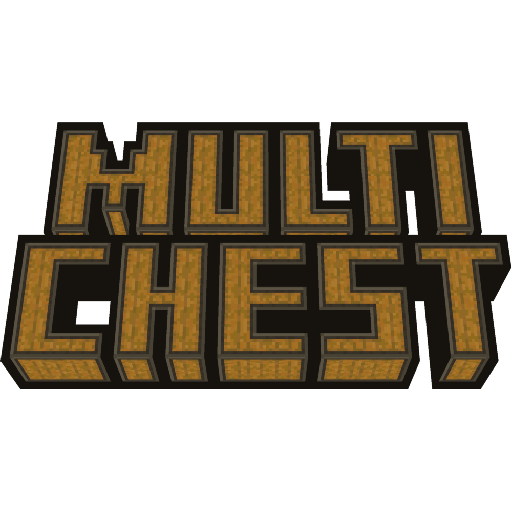
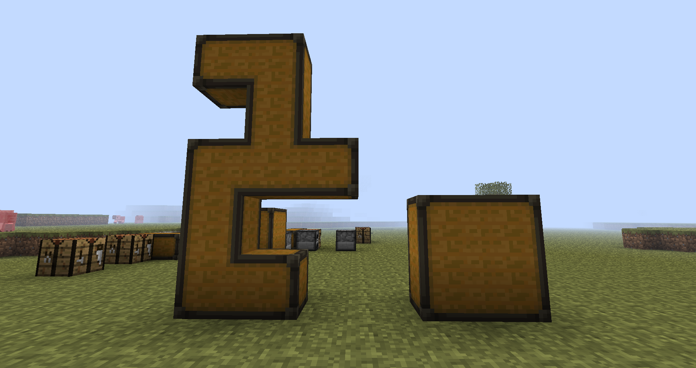
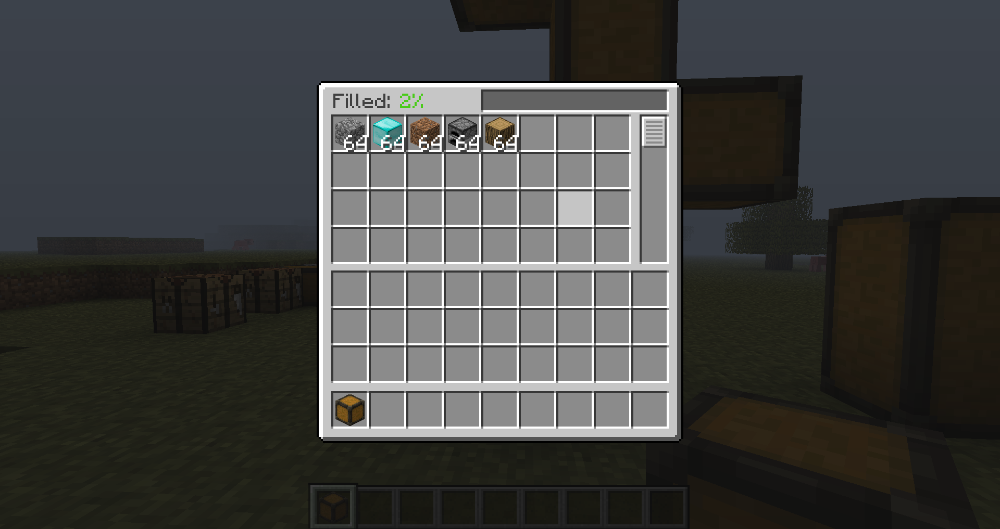
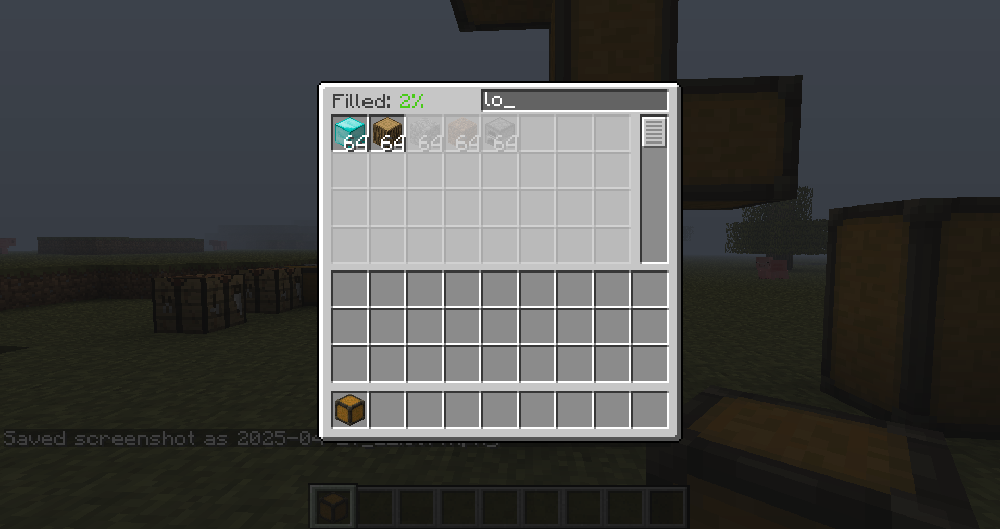
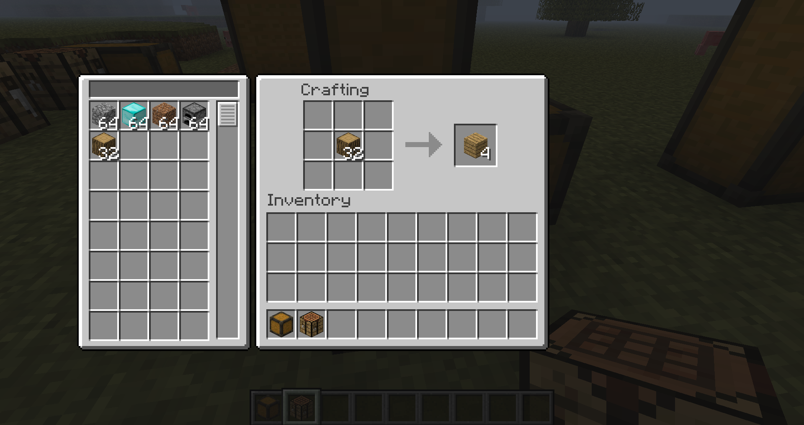

<table  align="center">
	<tbody>
		<tr>
			<td width="280px" style="text-align: center;"></td>		
			<td>
				<h2 align="left">Multichest</h2>
				
<b>for Minecraft Beta 1.7.3</b>

				
				
Mod that adds a modular chest block with shared inventory for Minecraft beta 1.7.3 (for StAPI)

			</td>		
		</tr>
	</tbody>
</table>

**Feature List:**
- Multichest block that can connect to each other
- Shared inventory between multichest blocks, more block will give bigger inventory
- Item search filter (will display searched items first in list, will not lock other items)
- Ability to use items in Crafting Table and Furnace if they are connected to Multichest

<table style="width:100%" align="center">
	<tbody>
		<tr>
			<td style="text-align: center; align-content: center;">Can have any shape</td>
			<td style="text-align: center; align-content: center;">Chest GUI</td>
		</tr>
		<tr>
			<td style="text-align: center; align-content: center;">Item filter</td>
			<td style="text-align: center; align-content: center;">Connected Crafting Table</td>
		</tr>
	</tbody>
</table>